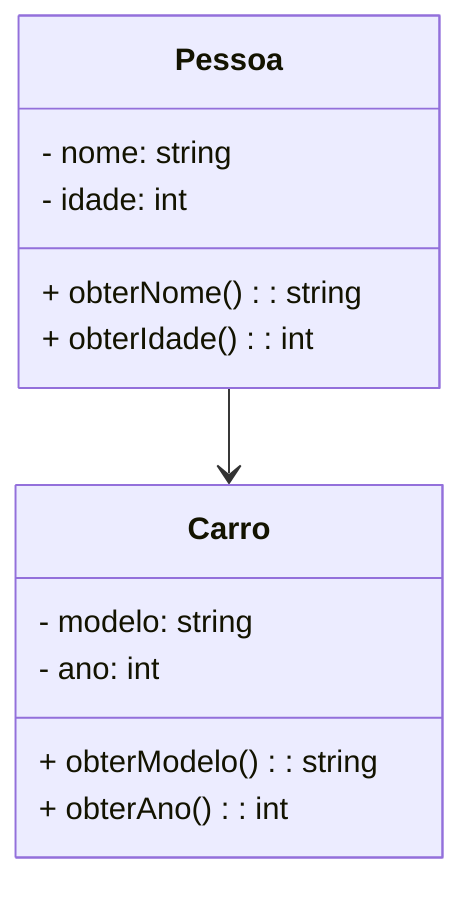

# Relações entre classes: associação, agregação e composição

A associação é um dos tipos de relacionamento entre classes em programação orientada a objetos, onde uma classe está relacionada a outra classe de alguma forma. A associação representa uma ligação entre objetos de classes diferentes, indicando que um objeto de uma classe usa, possui ou está relacionado a um ou mais objetos de outra classe.

Existem três tipos comuns de associação:

1. Associação unidirecional: Nesse tipo de associação, uma classe usa ou possui um objeto de outra classe, mas a classe referenciada não está ciente da classe que a está utilizando. Essa é a forma mais simples de associação.

2. Associação bidirecional: Nesse tipo de associação, as classes envolvidas estão cientes uma da outra e podem interagir diretamente.

3. Associação agregação/composição: Essa forma de associação indica que uma classe possui uma coleção de objetos de outra classe, onde a destruição da classe proprietária não implica necessariamente na destruição dos objetos pertencentes a ela.

Aqui está um exemplo que representa uma associação entre classes no diagrama UML:



Neste exemplo, temos duas classes: `Pessoa` e `Carro`. A classe `Pessoa` possui atributos `nome` e `idade`, juntamente com os métodos `obterNome()` e `obterIdade()`. A classe `Carro` possui atributos `modelo` e `ano`, juntamente com os métodos `obterModelo()` e `obterAno()`. A seta `-->` representa a associação unidirecional, indicando que a classe `Pessoa` está associada à classe `Carro`.

Aqui está uma implementação em Python das classes `Pessoa` e `Carro` com a associação correspondente:

```python
class Pessoa:
    def __init__(self, nome, idade):
        self.nome = nome
        self.idade = idade

    def obterNome(self):
        return self.nome

    def obterIdade(self):
        return self.idade


class Carro:
    def __init__(self, modelo, ano):
        self.modelo = modelo
        self.ano = ano

    def obterModelo(self):
        return self.modelo

    def obterAno(self):
        return self.ano


pessoa = Pessoa("João", 30)
carro = Carro("Toyota", 2022)

pessoaCarro = carro  # Associação entre pessoa e carro

print(pessoa.obterNome())     # Saída: João
print(carro.obterModelo())    # Saída: Toyota
print(pessoaCarro.obterAno())  # Saída: 2022
```

Nesse exemplo, uma instância da classe `Pessoa` (representando uma pessoa chamada João) está associada a uma instância da classe `Carro` (representando um carro da marca Toyota). A associação é estabelecida ao atribuir o objeto `carro` à variável `pessoaCarro`. Assim, podemos acessar os atributos e métodos das classes associadas a partir dessa variável.
