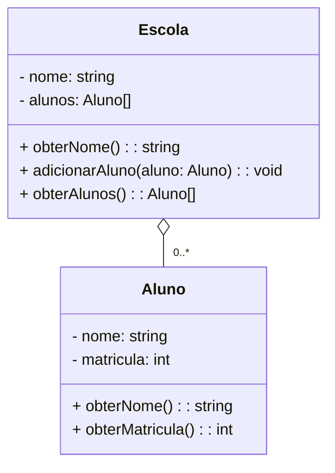

# Agregação - Python Orientado a Objetos

A agregação é um tipo de relacionamento entre classes em programação orientada a objetos, onde uma classe possui uma coleção ou um grupo de objetos de outra classe. A agregação é um subconjunto de associação e é uma forma mais forte, onde a classe agregadora possui uma relação de "todo-parte" com a classe agregada. Isso significa que a classe agregadora contém referências para objetos individuais da classe agregada, mas esses objetos podem existir independentemente da classe agregadora.

Aqui está um exemplo que representa uma agregação entre classes no diagrama UML:



Neste exemplo, temos duas classes: `Escola` e `Aluno`. A classe `Escola` possui um atributo `nome` e uma coleção de objetos `alunos`. Ela também possui os métodos `obterNome()` para retornar o nome da escola, `adicionarAluno()` para adicionar um aluno à lista de alunos e `obterAlunos()` para retornar a lista de alunos. A classe `Aluno` possui os atributos `nome` e `matricula`, juntamente com os métodos `obterNome()` e `obterMatricula()`. A linha `o--` com um multiplicidade `0..*` representa a agregação, indicando que a classe `Escola` possui vários objetos `Aluno`.

Aqui está uma implementação em Python das classes `Escola` e `Aluno` com a agregação correspondente:

```python
class Escola:
    def __init__(self, nome):
        self.nome = nome
        self.alunos = []

    def obterNome(self):
        return self.nome

    def adicionarAluno(self, aluno):
        self.alunos.append(aluno)

    def obterAlunos(self):
        return self.alunos


class Aluno:
    def __init__(self, nome, matricula):
        self.nome = nome
        self.matricula = matricula

    def obterNome(self):
        return self.nome

    def obterMatricula(self):
        return self.matricula


escola = Escola("Escola XYZ")
aluno1 = Aluno("João", 123)
aluno2 = Aluno("Maria", 456)

escola.adicionarAluno(aluno1)
escola.adicionarAluno(aluno2)

print(escola.obterNome())                 # Saída: Escola XYZ
print(escola.obterAlunos()[0].obterNome())  # Saída: João
print(escola.obterAlunos()[1].obterNome())  # Saída: Maria
```

Nesse exemplo, a classe `Escola` possui uma agregação com a classe `Aluno`. A instância da classe `Escola` representa uma escola chamada "Escola XYZ", que possui uma coleção de objetos `Aluno` (representando os alunos matriculados). Os alunos são adicionados à lista de alunos por meio do método `adicionarAluno()`. Podemos acessar os atributos e métodos dos alunos por meio da escola, usando o método `obterAlunos()`.