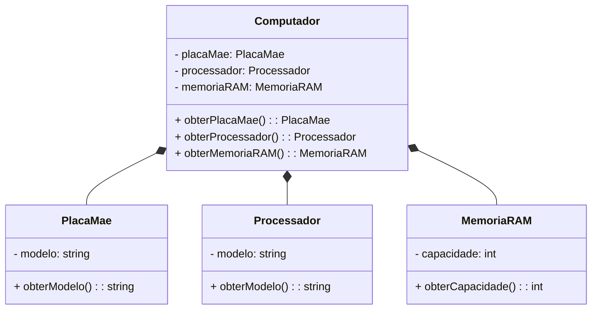

# Composição - Python Orientado a Objetos

A composição é um tipo de relacionamento entre classes em programação orientada a objetos, onde uma classe é composta por outras classes como suas partes constituintes. Na composição, a existência das partes está diretamente ligada à existência da classe composta. Isso significa que as partes são criadas e destruídas junto com a classe composta.

Aqui está um exemplo que representa uma composição entre classes no diagrama UML:



Neste exemplo, temos quatro classes: `Computador`, `PlacaMae`, `Processador` e `MemoriaRAM`. A classe `Computador` possui atributos que representam as partes constituintes do computador: `placaMae`, `processador` e `memoriaRAM`. Cada uma dessas partes é representada por uma classe separada. A classe `Computador` possui métodos para obter cada uma dessas partes.

A linha `*--` representa a composição, indicando que a classe `Computador` é composta pelas classes `PlacaMae`, `Processador` e `MemoriaRAM`.

Aqui está uma implementação em Python das classes `Computador`, `PlacaMae`, `Processador` e `MemoriaRAM` com a composição correspondente:

```python
class Computador:
    def __init__(self, placaMae, processador, memoriaRAM):
        self.placaMae = placaMae
        self.processador = processador
        self.memoriaRAM = memoriaRAM

    def obterPlacaMae(self):
        return self.placaMae

    def obterProcessador(self):
        return self.processador

    def obterMemoriaRAM(self):
        return self.memoriaRAM


class PlacaMae:
    def __init__(self, modelo):
        self.modelo = modelo

    def obterModelo(self):
        return self.modelo


class Processador:
    def __init__(self, modelo):
        self.modelo = modelo

    def obterModelo(self):
        return self.modelo


class MemoriaRAM:
    def __init__(self, capacidade):
        self.capacidade = capacidade

    def obterCapacidade(self):
        return self.capacidade


placa_mae = PlacaMae("ASUS")
processador = Processador("Intel i7")
memoria_ram = MemoriaRAM(16)

computador = Computador(placa_mae, processador, memoria_ram)

print(computador.obterPlacaMae().obterModelo())    # Saída: ASUS
print(computador.obterProcessador().obterModelo())  # Saída: Intel i7
print(com

putador.obterMemoriaRAM().obterCapacidade())  # Saída: 16
```

Nesse exemplo, a classe `Computador` é composta pelas classes `PlacaMae`, `Processador` e `MemoriaRAM`. Ao criar uma instância da classe `Computador`, passamos instâncias das partes constituintes como argumentos. Podemos então acessar as partes do computador por meio dos métodos `obterPlacaMae()`, `obterProcessador()` e `obterMemoriaRAM()`.