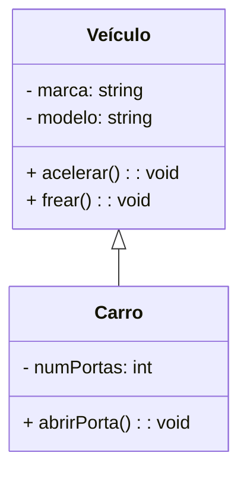

# TEORIA: Herança, generalização e especialização

Em resumo de associação entre classes:

1. Associação: `"usa"`

2. Agregação: `"tem"`

3. Composição: `"é dono de"`

Já a herança se resume em `"é um"`

> ## **Herança**

Na programação orientada a objetos, a herança é baseada na ideia de generalização e especialização que permite criar classes especializadas que **herdam as características e comportamentos** de uma classe genérica.

A generalização é usada para criar classes mais genéricas e abstratas a partir de classes mais específicas. Ela representa uma relação "é um" entre as classes, onde a classe mais genérica representa um conjunto maior de objetos e a classe mais específica representa um subconjunto desse conjunto maior. A classe mais genérica herda atributos e comportamentos comuns a todas as suas subclasses, proporcionando reutilização de código e facilitando a organização hierárquica das classes.

A especialização é usada para criar classes mais específicas a partir de classes mais genéricas. Ela representa uma relação de refinamento ou especialização, onde a classe mais específica representa um subconjunto ou uma especialização da classe mais genérica. A classe mais específica herda atributos e comportamentos da classe mais genérica, mas também pode adicionar novos atributos e comportamentos exclusivos.

A herança permite criar hierarquias de classes, onde as classes mais genéricas estão no topo e as classes mais específicas estão na parte inferior. Essa hierarquia facilita a organização e a modelagem de sistemas complexos, permitindo que as classes compartilhem atributos e comportamentos comuns e, ao mesmo tempo, possuam características distintas.

Aqui está um exemplo que representa a herança entre as classes "Veículo" e "Carro" no diagrama UML:

Neste exemplo, a classe "Veículo" é a super classe ou classe pai, e a classe "Carro" é a sub classe ou classe filha. A linha `<|--` indica a relação de herança, onde "Veículo" é a classe pai e "Carro" é a classe filha. Resumindo, "Carro" é um "Veículo".

A classe "Veículo" possui os atributos "marca" e "modelo" e os métodos "acelerar()" e "frear()". A classe "Carro" herda esses atributos e métodos da classe "Veículo" e adiciona o atributo "numPortas" e o método "abrirPorta()", que são específicos para carros.

Esse diagrama representa a relação de herança, onde a classe "Carro" é uma especialização da classe "Veículo". A classe "Carro" herda os atributos e métodos da classe "Veículo" e também adiciona seus próprios atributos e métodos exclusivos.

Desse modo, a herança permite uma modelagem hierárquica e organizada das classes, facilitando a reutilização de código e a definição de comportamentos específicos para cada classe especializada.