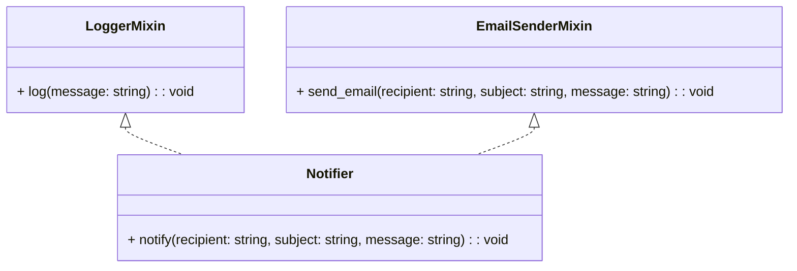

# Teoria - Herança múltipla - Python Orientado a Objetos 

Herança múltipla é um conceito em programação orientada a objetos que permite que uma classe herde características e comportamentos de várias classes pai. No entanto, a herança múltipla pode tornar-se complexa e propensa a problemas de ambiguidade (problema do diamante) quando várias classes pai têm métodos ou atributos com o mesmo nome. É aí que entram os mixins.

Mixins são classes que contêm funcionalidades específicas que podem ser adicionadas a outras classes por meio de herança múltipla. Eles não são projetados para serem instanciados por si mesmos, mas sim para fornecer recursos adicionais a outras classes. Os mixins geralmente não possuem estado próprio e não devem ter dependências diretas em outras classes.

Os mixins são úteis quando queremos compartilhar funcionalidades comuns entre diferentes classes, sem precisar criar uma hierarquia complexa de herança. Eles fornecem uma maneira flexível de adicionar comportamentos a uma classe sem se preocupar com os problemas de ambiguidade da herança múltipla.

Aqui está um exemplo para ilustrar a herança múltipla e mixins:



```python
class LoggerMixin:
    def log(self, message):
        print(f"Log: {message}")


class EmailSenderMixin:
    def send_email(self, recipient, subject, message):
        print(f"Sending email to {recipient}: {subject} - {message}")


class Notifier(LoggerMixin, EmailSenderMixin):
    def notify(self, recipient, subject, message):
        self.log(f"Notification sent to {recipient}: {subject} - {message}")
        self.send_email(recipient, subject, message)


notifier = Notifier()
notifier.notify("john@example.com", "Important Notification", "Hello, John!")
```

Neste exemplo, temos três classes: `LoggerMixin`, `EmailSenderMixin` e `Notifier`. A classe `LoggerMixin` fornece o comportamento de registro (logging) através do método `log()`. A classe `EmailSenderMixin` fornece o comportamento de envio de e-mails através do método `send_email()`. A classe `Notifier` combina esses dois mixins para enviar notificações que são registradas e enviadas por e-mail.

Ao criar uma instância de `Notifier` e chamar o método `notify()`, a instância pode usar os métodos `log()` e `send_email()` fornecidos pelos mixins `LoggerMixin` e `EmailSenderMixin`. O código de exemplo mostra como a funcionalidade de registro e envio de e-mails é compartilhada e usada pela classe `Notifier` através da herança múltipla e mixins.

O uso de mixins permite que diferentes classes compartilhem funcionalidades comuns de maneira flexível, evitando os problemas de ambiguidade da herança múltipla. Isso torna o código mais modular, reutilizável e facilita a adição de comportamentos adicionais a várias classes sem a necessidade de criar uma complexa hierarquia de herança.

> ## **Problema do diamante em herança múltipla**

O problema do diamante ocorre quando uma classe herda de duas classes que, por sua vez, herdam de uma mesma classe pai. Isso cria uma ambiguidade sobre qual implementação de método deve ser usada pela classe filha. Para resolver esse problema, o Python utiliza o algoritmo C3 Superclass Linearization para determinar a ordem correta de resolução de métodos que está implementado no método de classe `mro()` ou no dunder `__mro__()`.

Aqui está um diagrama UML para ilustrar o problema do diamante e como o algoritmo MRO resolve essa ambiguidade:

```mermaid
classDiagram
    class A {
        + foo(): void
    }
    
    class B extends A {
        + foo(): void
    }
    
    class C extends A {
        + foo(): void
    }
    
    class D extends B, C {
        + foo(): void
    }
    
    A <|-- B
    A <|-- C
    B <|-- D
    C <|-- D
```

Neste diagrama, temos a classe `A` como classe pai, e as classes `B` e `C` herdando dela. Em seguida, a classe `D` herda de ambas as classes `B` e `C`. Essa configuração cria um problema do diamante, pois a classe `D` herda a implementação do método `foo()` de ambas as classes `B` e `C`, que, por sua vez, herdam o método `foo()` da classe `A`.

Quando ocorre uma chamada ao método `foo()` em um objeto da classe `D`, o algoritmo MRO é usado para determinar a ordem de pesquisa dos métodos nas classes envolvidas. O algoritmo C3 Superclass Linearization, utilizado pelo Python, garante que a resolução de métodos ocorra de forma consistente e sem ambiguidades.

A ordem de resolução dos métodos de acordo com o algoritmo C3 Linearization é calculada levando em consideração a hierarquia de herança. No caso do problema do diamante, a ordem de resolução do método `foo()` para a classe `D` seria: `D -> B -> C -> A`. Isso significa que o método `foo()` da classe `B` será chamado primeiro, seguido pelo método `foo()` da classe `C` e, por fim, o método `foo()` da classe `A`.

Dessa forma, o Python utiliza o algoritmo C3 Superclass Linearization (MRO) para resolver o problema do diamante, garantindo a ordem correta de resolução dos métodos em casos de herança múltipla. Isso evita ambiguidades e garante que os métodos sejam executados na ordem correta de acordo com a hierarquia de classes.